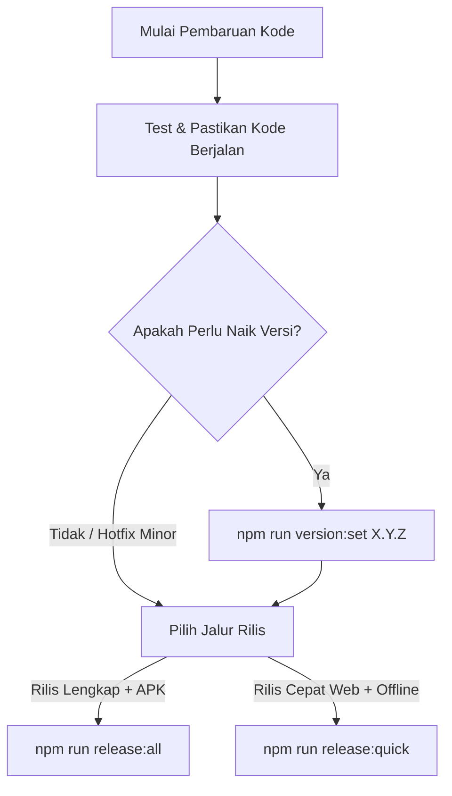

# Panduan Kontrol Versi 1 Gerbang (Single-Gate Version Management)

Dokumen ini adalah acuan resmi bagi developer dan AI Agent mengenai tata cara meningkatkan dan mengelola versi sistem Examku.

---

## 1. Prinsip Utama: Single-Gate Versioning
**DILARANG KERAS** mengedit atau memperbarui nomor versi secara manual di file terpisah (`package.json`, `build.gradle`, `version.ts`, `version.json`, dll).

Semua peningkatan versi sistem **WAJIB** melalui satu pintu perintah gerbang:
```bash
npm run version:set <versi_baru> [--notes "Catatan Rilis"]
```

Contoh:
```bash
# Patch bump
npm run version:set 1.1.2

# Minor bump dengan catatan rilis
npm run version:set 1.2.0 --notes "Peningkatan proteksi mode kiosk & pembaruan UI"
```

---

## 2. Kapan AI Agent / Developer Harus Menaikkan Versi?
1. **Permintaan Pengguna**: Pengguna meminta rilis versi baru, build ulang sistem secara menyeluruh, atau menentukan nomor versi target (misal: "update ke v1.1.2", "build ulang semua").
2. **Perubahan Produksi Krusial**: Fitur baru, perbaikan bug kritis, atau patch keamanan yang dirilis ke server produksi dan memerlukan pembaruan di sisi klien (Web, Android APK Exambro, atau Server Offline sekolah).
3. **Sebelum Eksekusi Rilis Master**: Sebelum mengeksekusi `npm run release:all` atau `npm run release:quick`, pastikan nomor versi sudah dinaikkan jika rilis tersebut membawa perubahan versi baru.

---

## 3. Komponen yang Otomatis Disinkronkan (6 Gerbang)
Script `scripts/set-version.js` secara otomatis memvalidasi format SemVer (`X.Y.Z`) dan menyinkronkan 6 gerbang:

| No | Komponen / File | Yang Diperbarui |
|---|---|---|
| 1 | `package.json` | Field `"version": "X.Y.Z"` |
| 2 | `src/utils/version.ts` | Konstanta `APP_VERSION = "X.Y.Z"` & `APP_DISPLAY_VERSION = "vX.Y.Z"` (digunakan di Navbar, Sidebar, Footer, Pilih Sekolah) |
| 3 | `android/app/build.gradle` | `versionName "X.Y.Z"` dan `versionCode` otomatis naik +1 |
| 4 | `public/version.json` & `offline_package/version.json` | Metadata CDN & rilis offline (versi, tanggal rilis, catatan rilis) |
| 5 | `pb_hooks/offline_update.pb.js` & template hooks | Konstanta fallback versi server PocketBase |
| 6 | `scripts/release-all.js` | Konstanta rilis fallback |

---

## 4. Alur Kerja Standar Rilis (Standard Release Flow)



1. **Set Versi**:
   ```bash
   npm run version:set 1.1.2 --notes "Perbaikan navigasi ujian dan pengetatan kiosk"
   ```
2. **Jalankan Rilis**:
   - Jika butuh APK Android baru:
     ```bash
     npm run release:all
     ```
   - Jika hanya Web, Hooks VPS, Tenants, dan Paket Offline:
     ```bash
     npm run release:quick
     ```
