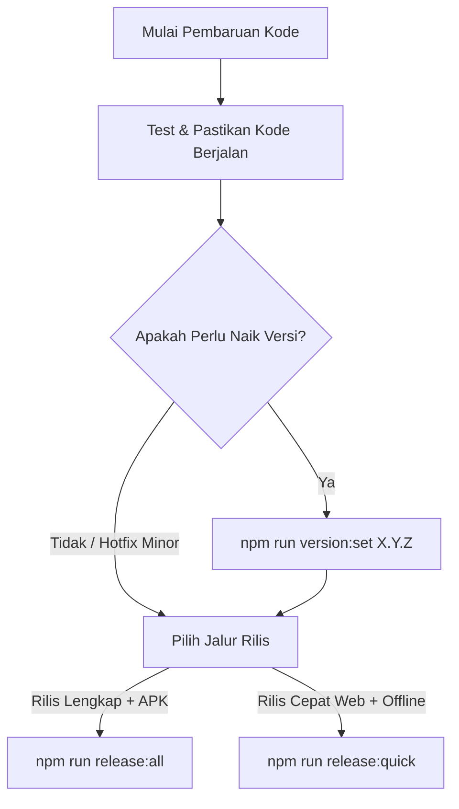

# Manajemen Versi & Force Update APK

Dokumen ini adalah acuan resmi bagi developer dan AI Agent mengenai tata cara meningkatkan dan mengelola versi sistem Examku, serta cara kerja fitur force update aplikasi Android siswa.

## Prinsip Utama: Single-Gate Versioning

**DILARANG KERAS** mengedit atau memperbarui nomor versi secara manual di file terpisah (`package.json`, `build.gradle`, `version.ts`, `version.json`, dll).

Semua peningkatan versi sistem **WAJIB** melalui satu pintu perintah gerbang:

```bash
npm run version:set <versi_baru> [--notes "Catatan Rilis"]
```

## Kapan Harus Menaikkan Versi?

1. **Permintaan Pengguna**: Pengguna meminta rilis versi baru, build ulang sistem secara menyeluruh, atau menentukan nomor versi target.
2. **Perubahan Produksi Krusial**: Fitur baru, perbaikan bug kritis, atau patch keamanan yang dirilis ke produksi dan memerlukan pembaruan di sisi klien.
3. **Sebelum Eksekusi Rilis Master**: Sebelum `npm run release:all` atau `npm run release:quick`, pastikan versi sudah dinaikkan jika rilis membawa perubahan versi baru.

## Konsep Dasar: VersionCode vs VersionName

Setiap APK Android punya dua identitas versi:

| Istilah | Contoh | Fungsi |
|---|---|---|
| **VersionName** | `1.1.18` | Label yang dibaca manusia, tampil di layar HP |
| **VersionCode** | `20` | Angka integer tersembunyi, dipakai sistem untuk perbandingan |

**Yang menentukan force update adalah VersionCode (angka), bukan VersionName (label).**

**Aturan versionCode:**
- Wajib selalu naik (+1 setiap rilis), tidak boleh turun
- Maksimal: 2,1 miliar (jadi angka 100, 500, 1000 tidak masalah)
- Android menolak "update" ke versionCode yang lebih rendah (dianggap downgrade)

Logika di `src/components/auth/AppVersionGuard.tsx`:
```javascript
if (forceUpdate && installedBuild < minVersionCode) {
  // Kunci aplikasi, tampilkan layar wajib update
}
```

## Satu Gerbang Versi (Single-Gate)

Gunakan satu perintah:

```bash
npm run version:set <versi_baru> [--notes "Catatan Rilis"]
```

Contoh:
```bash
# Patch bump (perbaikan kecil)
npm run version:set 1.1.19

# Minor bump (fitur baru) dengan catatan
npm run version:set 1.2.0 --notes "Fitur analisis butir soal baru"
```

### 7 Gerbang Otomatis

Perintah di atas otomatis menyinkronkan ke 7 tempat:

| No | Komponen / File | Yang Diperbarui |
|---|---|---|
| 1 | `package.json` | Field `"version": "X.Y.Z"` |
| 2 | `src/utils/version.ts` | `APP_VERSION` & `APP_DISPLAY_VERSION` (Navbar, Sidebar, Footer) |
| 3 | `android/app/build.gradle` | `versionName "X.Y.Z"` dan `versionCode` otomatis naik +1 |
| 4 | `public/version.json` & `offline_package/version.json` | Metadata CDN & rilis offline |
| 5 | `pb_hooks/offline_update.pb.js` & template hooks | Konstanta fallback versi server |
| 6 | `scripts/release-all.js` | Konstanta rilis fallback |
| 7 | `app_settings` di Master PB | `min_version_code` & `min_version_name` (via step [7/7] di `release-all.js`) |

**Catatan:** `is_force_update` di `app_settings` TIDAK diubah otomatis — tetap dikontrol manual via dashboard superadmin.

## Alur Kerja Standar Rilis



1. **Set Versi**:
   ```bash
   npm run version:set 1.1.19 --notes "Perbaikan navigasi ujian dan pengetatan kiosk"
   ```
2. **Jalankan Rilis**:
   - Jika butuh APK Android baru:
     ```bash
     npm run release:all
     ```
   - Jika hanya Web, Hooks VPS, Tenants, dan Paket Offline:
     ```bash
     npm run release:quick
     ```

## Cara Cek Versi Saat Ini

```bash
# Lihat versionName (dari package.json)
npm run version:set
# Output: "Versi saat ini: 1.1.19"

# Lihat versionCode (dari build.gradle)
grep "versionCode" android/app/build.gradle
# Output: versionCode 21
```

## Alur Rilis Normal

```bash
# 1. Naikkan versi
npm run version:set 1.1.19

# 2. Rilis lengkap (build APK + deploy + sync)
npm run release:all

# ATAU rilis cepat tanpa build APK:
npm run release:quick
```

Setelah `release:all`:
- APK baru (versionCode 21) ter-upload ke server
- `app_settings` otomatis update: min_version_code = 21
- HP siswa dengan build < 21 langsung dikunci saat buka aplikasi

## Cara Kerja Force Update

### Di Aplikasi (Exam AA)

1. Saat aplikasi dibuka, `AppVersionGuard` berjalan (hanya di Android/iOS native)
2. Ambil info versi terinstall via Capacitor: `App.getInfo()` → `build`, `version`
3. Ambil konfigurasi dari Master PocketBase: collection `app_settings`
4. Bandingkan: jika `is_force_update = true` DAN `installedBuild < min_version_code` → tampilkan layar kunci
5. Siswa wajib download APK baru via tombol yang disediakan

### Di Dashboard Superadmin

**Lokasi:** Superadmin → Pengaturan → Versi APK Siswa

| Field | Isi dengan | Contoh |
|---|---|---|
| Nama Aplikasi | Nama app | `EXAM AA` |
| Versi Minimal Label | VersionName APK terbaru | `1.1.18` |
| Kode Versi Minimal | VersionCode APK terbaru | `20` |
| Download URL | Link APK terbaru | `http://examku.my.id/exam-aa-latest.apk` |
| Force Update toggle | ON untuk paksa update | — |

**PENTING:** Kode Versi Minimal harus sama dengan (atau lebih tinggi dari) versionCode APK terbaru di `android/app/build.gradle`. Jika lebih rendah, tidak ada HP yang diblokir.

## Troubleshooting

### Force update tidak berfungsi

1. **Cek Kode Versi Minimal** — pastikan angkanya >= versionCode APK terbaru di build.gradle
   ```bash
   grep "versionCode" android/app/build.gradle
   ```
2. **Cek toggle Force Update** — harus ON (biru)
3. **Cek di HP** — buka aplikasi, lihat apakah layar kunci muncul. Jika tidak, berarti `installedBuild >= minVersionCode`
4. **Cek koneksi** — aplikasi harus bisa akses Master PocketBase untuk ambil konfigurasi

### Setting tidak tersimpan

- Pastikan login sebagai Super Admin
- Cek console browser (F12) untuk error
- Pastikan collection `app_settings` ada di Master PocketBase

### Setelah release:all, setting tidak update otomatis

- Cek output step [7/7] — pastikan tidak ada error SSH
- Pastikan file `/usr/local/bin/update-app-settings.py` ada di Master VPS
- Bisa update manual via dashboard sebagai fallback

## File Terkait

| File | Fungsi |
|---|---|
| `scripts/set-version.js` | Single-gate version bump (6 gerbang lokal) |
| `scripts/release-all.js` | Pipeline rilis + step [7/7] sync app_settings |
| `vps/update-app-settings.py` | Script Python di Master VPS untuk update collection |
| `src/components/auth/AppVersionGuard.tsx` | Komponen React yang mengunci aplikasi usang |
| `src/pages/superadmin/SuperAdminSettingsPage.tsx` | Form pengaturan versi di dashboard |
| `android/app/build.gradle` | Sumber kebenaran versionCode/versionName APK |
